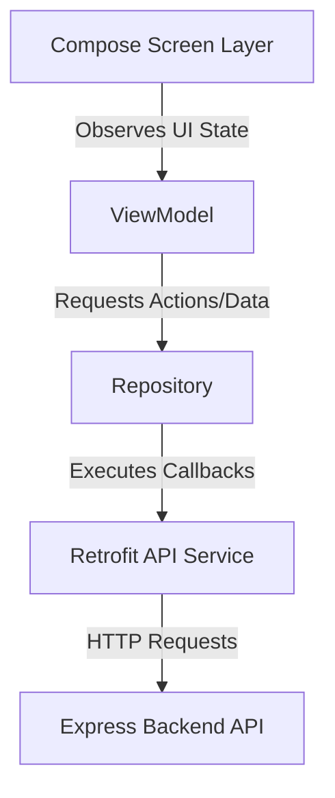

# StuEarn India - Android Frontend (Jetpack Compose) Integration Guide

This comprehensive documentation details the architecture, dynamic bindings, and endpoint mapping utilized in the Kotlin/Jetpack Compose frontend to integrate with the backend API endpoints (such as Earnings feeds, dynamic Payout Methods with multi-field credentials, Support Tickets lifecycle, and Firebase Cloud Messaging alerts).

---

## 🏛️ 1. Architecture Overview (MVVM Pattern)

The StuEarn Android client relies on the standard **Model-View-ViewModel (MVVM)** architecture paired with a clean Repository pattern to isolate UI components, state management, and network layers.



* **Model Layer:** Data transfer objects (DTOs) representing Server responses (e.g. `UserResponse`, `EarningsTickerResponse`, `PayoutMethodsResponse`).
* **ViewModel Layer:** Jetpack Lifecycle-aware ViewModels (`WalletViewModel`, `ProfileViewModel`, `SupportTicketViewModel`) holding Compose states (`StateFlow` or `MutableState`) and exposing unidirectional events to screens.
* **View Layer (Jetpack Compose):** UI Screens declarative reactive UI.

---

## 📊 2. Dynamic Earnings Ticker Binding

The real-time feed displays earning credits completed by other users, pulling from the `/api/ticker/earnings` endpoint.

### A. Kotlin Data DTO Mapping
```kotlin
data class EarningsTickerItem(
    @SerializedName("username") val username: String,
    @SerializedName("amount") val amount: Double,
    @SerializedName("offer_name") val offerName: String,
    @SerializedName("logo_url") val logoUrl: String,
    @SerializedName("timestamp") val timestamp: String,
    @SerializedName("time_ago") val timeAgo: String
)
```

### B. Compose Rendering Component
The logoUrl field is loaded dynamically using Coil:

```kotlin
@Composable
fun EarningTickerItem(item: EarningsTickerItem) {
    Card(
        shape = RoundedCornerShape(12.dp),
        colors = CardDefaults.cardColors(containerColor = MaterialTheme.colorScheme.surfaceVariant),
        modifier = Modifier.padding(horizontal = 6.dp, vertical = 4.dp)
    ) {
        Row(
            verticalAlignment = Alignment.CenterVertically,
            modifier = Modifier.padding(12.dp)
        ) {
            AsyncImage(
                model = item.logoUrl, // Dynamic Postimg/ImgBB logo URL from backend
                contentDescription = "Offerwall Logo",
                modifier = Modifier
                    .size(32.dp)
                    .clip(CircleShape)
            )
            Spacer(modifier = Modifier.width(8.dp))
            Column {
                Text(
                    text = "@${item.username} earned",
                    style = MaterialTheme.typography.bodySmall,
                    color = MaterialTheme.colorScheme.onSurfaceVariant
                )
                Text(
                    text = "${item.offerName} (+${item.amount.toInt()} Coins)",
                    style = MaterialTheme.typography.labelMedium,
                    fontWeight = FontWeight.Bold,
                    color = Color(0xFF10B981) // Green success color
                )
            }
        }
    }
}
```

---

## 💳 3. Dynamic Payout Gateways & Multiple Custom Inputs

The withdrawal UI consists of active payout methods supporting **multiple custom input criteria** (e.g. Account Number + IFSC Code + Holder Name) and fixed redeem tiers configured dynamically from the admin panel.

### A. Data Models
The backend stores multiple inputs as comma-separated values inside `inputType`, `inputLabel`, and `inputPlaceholder`. The Android client should parse these properties into clean lists of fields.

```kotlin
data class PayoutMethod(
    @SerializedName("id") val id: String,
    @SerializedName("name") val name: String,
    @SerializedName("description") val description: String,
    @SerializedName("iconUrl") val iconUrl: String,
    @SerializedName("minCoins") val minCoins: Int,
    @SerializedName("conversionRate") val conversionRate: Double,
    @SerializedName("currencySymbol") val currencySymbol: String,
    @SerializedName("processingTime") val processingTime: String,
    @SerializedName("inputType") val inputType: String,            // Comma-separated: "text,text,number"
    @SerializedName("inputLabel") val inputLabel: String,          // Comma-separated: "Account Number,IFSC,Mobile"
    @SerializedName("inputPlaceholder") val inputPlaceholder: String, // Comma-separated: "Enter number,Enter IFSC,Enter mobile"
    @SerializedName("tiers") val tiers: List<RedeemTier>
)

data class RedeemTier(
    @SerializedName("id") val id: String,
    @SerializedName("coinCost") val coinCost: Int,                  // e.g. 1000
    @SerializedName("monetaryValue") val monetaryValue: Double,     // e.g. 10.0
    @SerializedName("currencySymbol") val currencySymbol: String    // e.g. "₹"
)
```

### B. Dynamically Parsing & Rendering Multi-Field Input Forms
Split inputs by commas and map them to standard Compose TextFields. On submit, join the user details as a JSON object or unified string payload.

```kotlin
data class InputFieldConfig(
    val label: String,
    val placeholder: String,
    val type: String
)

@Composable
fun PayoutMultiDetailsForm(
    method: PayoutMethod,
    onSubmit: (amountCoins: Int, detailsJson: String) -> Unit
) {
    // 1. Parse Comma-Separated Configurations
    val labels = method.inputLabel.split(",")
    val placeholders = method.inputPlaceholder.split(",")
    val types = method.inputType.split(",")
    
    val fieldConfigs = remember(method) {
        val list = mutableListOf<InputFieldConfig>()
        val maxLen = maxOf(labels.size, placeholders.size, types.size)
        for (i in 0 until maxLen) {
            list.add(
                InputFieldConfig(
                    label = labels.getOrNull(i) ?: "Details",
                    placeholder = placeholders.getOrNull(i) ?: "Enter details",
                    type = types.getOrNull(i) ?: "text"
                )
            )
        }
        list
    }

    // 2. Track inputs map
    val inputValues = remember { mutableStateMapOf<Int, String>() }
    var selectedTier by remember { mutableStateOf<RedeemTier?>(null) }

    Column(modifier = Modifier.fillMaxWidth().padding(16.dp)) {
        Text("Select Exchange Amount", style = MaterialTheme.typography.titleMedium, fontWeight = FontWeight.Bold)
        
        // Grid of Fixed Redeem Tiers
        LazyVerticalGrid(
            columns = GridCells.Fixed(2),
            modifier = Modifier.height(140.dp).padding(vertical = 8.dp)
        ) {
            items(method.tiers) { tier ->
                Button(
                    onClick = { selectedTier = tier },
                    colors = ButtonDefaults.buttonColors(
                        containerColor = if (selectedTier?.id == tier.id) MaterialTheme.colorScheme.primary else MaterialTheme.colorScheme.surfaceVariant
                    ),
                    modifier = Modifier.padding(4.dp)
                ) {
                    Text("${tier.currencySymbol}${tier.monetaryValue} (${tier.coinCost} Coins)")
                }
            }
        }

        Spacer(modifier = Modifier.height(16.dp))
        Text("Required Receiving Details", style = MaterialTheme.typography.titleMedium, fontWeight = FontWeight.Bold)
        
        // Render Dynamic Dynamic TextFields
        fieldConfigs.forEachIndexed { index, config ->
            val currentValue = inputValues[index] ?: ""
            OutlinedTextField(
                value = currentValue,
                onValueChange = { inputValues[index] = it },
                label = { Text(config.label) },
                placeholder = { Text(config.placeholder) },
                keyboardOptions = KeyboardOptions(
                    keyboardType = when (config.type.lowercase().trim()) {
                        "email" -> KeyboardType.Email
                        "number" -> KeyboardType.Number
                        else -> KeyboardType.Text
                    }
                ),
                modifier = Modifier.fillMaxWidth().padding(vertical = 4.dp)
            )
        }

        Spacer(modifier = Modifier.height(16.dp))
        
        Button(
            onClick = {
                // Compile dynamic details to a JSON object
                val detailsMap = mutableMapOf<String, String>()
                fieldConfigs.forEachIndexed { idx, config ->
                    detailsMap[config.label] = inputValues[idx] ?: ""
                }
                val detailsJson = Gson().toJson(detailsMap)
                selectedTier?.let { onSubmit(it.coinCost, detailsJson) }
            },
            enabled = selectedTier != null && fieldConfigs.all { inputValues[fieldConfigs.indexOf(it)]?.isNotBlank() == true },
            modifier = Modifier.fillMaxWidth().height(50.dp)
        ) {
            Text("Confirm Withdrawal Request")
        }
    }
}
```

---

## 🎫 4. Support Tickets Lifecycle Integration (Both Ends)

Users can completely manage support ticket lifecycles dynamically: list active requests, open details thread, respond with replies, and close solved tickets directly.

### A. Endpoint Routes Mapping (Retrofit API Service)
```kotlin
interface SupportTicketApiService {
    @POST("/api/tickets")
    suspend fun createTicket(
        @Body request: CreateTicketRequest
    ): Response<GenericResponse>

    @GET("/api/tickets")
    suspend fun getTicketsList(): Response<TicketsListResponse>

    @GET("/api/tickets/{id}")
    suspend fun getTicketDetail(
        @Path("id") ticketId: String
    ): Response<TicketDetailResponse>

    @POST("/api/tickets/{id}/reply")
    suspend fun replyToTicket(
        @Path("id") ticketId: String,
        @Body replyRequest: ReplyRequest
    ): Response<GenericResponse>

    @POST("/api/tickets/{id}/close")
    suspend fun closeTicket(
        @Path("id") ticketId: String
    ): Response<GenericResponse>
}
```

### B. UI Lifecycle State Rules
* **Bubble Alignment:** Display replies where `sender_type == "ADMIN"` aligned to the left with highlighted tint, and `sender_type == "USER"` aligned to the right (representing self-replies).
* **Editor Locking:** If `ticket.status == "CLOSED"`, disable the message text area and submit button. Display a lock icon indicating the ticket is finalized.

---

## 🔔 5. Firebase Cloud Messaging (FCM) Integration

The Android client registers token profiles and handles push broadcast topics for highly scalable push dispatches.

### A. Token Registration
Synchronize FCM registration tokens upon successful authentication:
```kotlin
data class TokenPayload(
    @SerializedName("fcm_token") val fcmToken: String
)

// Call immediately on auth / token refreshes
// API Endpoint: POST /api/user/fcm
@POST("/api/user/fcm")
suspend fun registerFcmToken(@Body payload: TokenPayload): Response<GenericResponse>
```

### B. Topic Subscriptions (Very Scalable)
The app must automatically subscribe to the following standard Firebase messaging topics:
- **`all`** — System-wide broadcast alerts.
- **`offers`** — Offerwall alerts and survey multipliers.
- **`games`** — Daily spins, scratch tasks, and playtimes.
- **`wallet`** — Deductions, approvals, and balance warnings.
- **`vip`** — Elite bonuses and loyalty events.

Use the standard Firebase Messaging library:
```kotlin
FirebaseMessaging.getInstance().subscribeToTopic("all")
FirebaseMessaging.getInstance().subscribeToTopic("offers")
```

### C. Rich Media / Image Banners
The FCM payload contains a banner image URL in the `image` parameter (both inside the `notification` block and `data` block). In your `FirebaseMessagingService` receiver, fetch the bitmap dynamically using Glide or Coil before generating the system tray builder:
```kotlin
val imageUrl = remoteMessage.data["image"] ?: remoteMessage.notification?.imageUrl?.toString()
if (!imageUrl.isNullOrBlank()) {
    val futureTarget = Glide.with(context)
        .asBitmap()
        .load(imageUrl)
        .submit()
    val bitmap = futureTarget.get()
    notificationBuilder.setStyle(NotificationCompat.BigPictureStyle().bigPicture(bitmap))
}
```

---

## 🔄 6. Best Practices & API Synchronization

1. **Reactive UI State Syncing:** Trigger `ProfileViewModel.refreshWalletBalance()` (requesting `/api/wallet/balance`) immediately upon pull-to-refresh, offer completeds, or payouts to ensure user metrics are synchronized.
2. **Whole-Integer Costs:** Dynamic payouts validate integers only. Fractional coin requests are rejected.
3. **Signed Reversals:** Allow balance UI values to display negative balances safely without out-of-range crashes, accounting for S2S chargeback cancellations.
