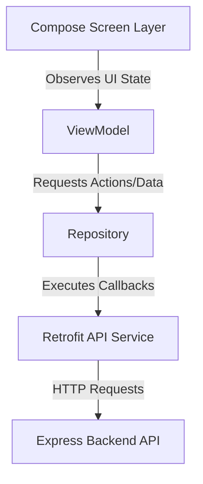

# StuEarn India - Android Frontend (Jetpack Compose) Integration Guide

This comprehensive documentation details the architecture, dynamic bindings, and endpoint mapping utilized in the Kotlin/Jetpack Compose frontend to integrate with the backend API endpoints (such as Earnings feeds, dynamic Payout Methods, custom user inputs, fixed Redeem Tiers, and balance updates).

---

## 🏛️ 1. Architecture Overview (MVVM Pattern)

The StuEarn Android client relies on the standard **Model-View-ViewModel (MVVM)** architecture paired with a clean Repository pattern to isolate UI components, state management, and network layers.



* **Model Layer:** Data transfer objects (DTOs) representing Server responses (e.g. `UserResponse`, `EarningsTickerResponse`, `PayoutMethodsResponse`).
* **ViewModel Layer:** Jetpack Lifecycle-aware ViewModels (`WalletViewModel`, `ProfileViewModel`, `WithdrawViewModel`) holding Compose states (`StateFlow` or `MutableState`) and exposing unidirectional events to screens.
* **View Layer (Jetpack Compose):** UI Screens (`WalletScreen`, `WithdrawScreen`, `RedeemTiersScreen`, `ProfileScreen`) constructed with declarative reactive UI.

---

## 📊 2. Dynamic Earnings Ticker Binding

The real-time feed displays earning credits completed by other users, pulling from the `/api/ticker/earnings` endpoint.

### A. Kotlin Data DTO Mapping
```kotlin
data class EarningsTickerItem(
    @SerializedName("username") val username: String,
    @SerializedName("amount") val amount: Double,
    @SerializedName("offer_name") val offerName: String,
    @SerializedName("logo_url") val logoUrl: String,
    @SerializedName("timestamp") val timestamp: String,
    @SerializedName("time_ago") val timeAgo: String
)
```

### B. Compose Rendering Component
The dynamic items are bound inside a horizontal scrolling row or marquee. The `logoUrl` field is loaded dynamically using Coil:

```kotlin
@Composable
fun EarningTickerItem(item: EarningsTickerItem) {
    Card(
        shape = RoundedCornerShape(12.dp),
        colors = CardDefaults.cardColors(containerColor = MaterialTheme.colorScheme.surfaceVariant),
        modifier = Modifier.padding(horizontal = 6.dp, vertical = 4.dp)
    ) {
        Row(
            verticalAlignment = Alignment.CenterVertically,
            modifier = Modifier.padding(12.dp)
        ) {
            AsyncImage(
                model = item.logoUrl, // Dynamic Postimg/ImgBB logo URL from backend
                contentDescription = "Offerwall Logo",
                modifier = Modifier
                    .size(32.dp)
                    .clip(CircleShape)
            )
            Spacer(modifier = Modifier.width(8.dp))
            Column {
                Text(
                    text = "@${item.username} earned",
                    style = MaterialTheme.typography.bodySmall,
                    color = MaterialTheme.colorScheme.onSurfaceVariant
                )
                Text(
                    text = "${item.offerName} (+${item.amount.toInt()} Coins)",
                    style = MaterialTheme.typography.labelMedium,
                    fontWeight = FontWeight.Bold,
                    color = Color(0xFF10B981) // Green success color
                )
            }
        }
    }
}
```

---

## 💳 3. Dynamic Payout Methods & fixed Tiers Integration

The withdrawal UI consists of a dynamic grid of active payout methods, supporting custom user input criteria and fixed reward exchange tiers managed live from the admin panel.

### A. Data Models
```kotlin
data class PayoutMethod(
    @SerializedName("id") val id: String,
    @SerializedName("name") val name: String,
    @SerializedName("description") val description: String,
    @SerializedName("iconUrl") val iconUrl: String,
    @SerializedName("minCoins") val minCoins: Int,
    @SerializedName("conversionRate") val conversionRate: Double,
    @SerializedName("currencySymbol") val currencySymbol: String,
    @SerializedName("inputType") val inputType: String,            // text, email, number
    @SerializedName("inputLabel") val inputLabel: String,          // e.g. "UPI ID"
    @SerializedName("inputPlaceholder") val inputPlaceholder: String, // e.g. "yourname@upi"
    @SerializedName("tiers") val tiers: List<RedeemTier>
)

data class RedeemTier(
    @SerializedName("id") val id: String,
    @SerializedName("coinCost") val coinCost: Int,                  // e.g. 1000
    @SerializedName("monetaryValue") val monetaryValue: Double,     // e.g. 10.0
    @SerializedName("currencySymbol") val currencySymbol: String    // e.g. "₹"
)
```

### B. Dynamically Rendering Payout Address Input Field
When the user selects a payout method (e.g. UPI, Paytm, Email), the Compose UI dynamically displays a single input field configured on the server-side to collect their target credentials safely:

```kotlin
@Composable
fun PayoutDetailsForm(
    method: PayoutMethod,
    onSubmit: (amountCoins: Int, payoutAddress: String) -> Unit
) {
    var payoutAddress by remember { mutableStateOf("") }
    var selectedTier by remember { mutableStateOf<RedeemTier?>(null) }

    Column(modifier = Modifier.fillMaxWidth().padding(16.dp)) {
        Text(
            text = "Select Exchange Amount",
            style = MaterialTheme.typography.titleMedium,
            fontWeight = FontWeight.Bold
        )
        
        // 1. Grid of Fixed Redeem Tiers
        LazyVerticalGrid(
            columns = GridCells.Fixed(2),
            modifier = Modifier.height(150.dp).padding(vertical = 8.dp)
        ) {
            items(method.tiers) { tier ->
                Button(
                    onClick = { selectedTier = tier },
                    colors = ButtonDefaults.buttonColors(
                        containerColor = if (selectedTier?.id == tier.id) 
                            MaterialTheme.colorScheme.primary 
                        else 
                            MaterialTheme.colorScheme.surfaceVariant
                    ),
                    modifier = Modifier.padding(4.dp)
                ) {
                    Text("${tier.currencySymbol}${tier.monetaryValue} (${tier.coinCost} Coins)")
                }
            }
        }

        Spacer(modifier = Modifier.height(16.dp))

        // 2. Dynamic Payout Input Field
        Text(
            text = "Receiving Details",
            style = MaterialTheme.typography.titleMedium,
            fontWeight = FontWeight.Bold
        )
        OutlinedTextField(
            value = payoutAddress,
            onValueChange = { payoutAddress = it },
            label = { Text(method.inputLabel) },           // Dynamic input label (e.g. "UPI ID")
            placeholder = { Text(method.inputPlaceholder) }, // Dynamic placeholder
            keyboardOptions = KeyboardOptions(
                keyboardType = when (method.inputType.lowercase()) { // Dynamic input type
                    "email" -> KeyboardType.Email
                    "number" -> KeyboardType.Number
                    else -> KeyboardType.Text
                }
            ),
            modifier = Modifier.fillMaxWidth().padding(vertical = 8.dp)
        )

        Button(
            onClick = { 
                selectedTier?.let { onSubmit(it.coinCost, payoutAddress) } 
            },
            enabled = selectedTier != null && payoutAddress.isNotBlank(),
            modifier = Modifier.fillMaxWidth().height(50.dp)
        ) {
            Text("Confirm Redemptions")
        }
    }
}
```

---

## ⚡ 4. Real-time Wallet History (Completions & Reversals)

The Wallet Ledger is managed through two feeds: **Earnings History** and **Withdrawals Queue** mapping dynamic descriptions and brand assets.

### A. Earning Item Bindings
```kotlin
data class TransactionItem(
    @SerializedName("id") val id: String,
    @SerializedName("amount") val amount: Double,
    @SerializedName("type") val type: String, // CREDIT or DEBIT
    @SerializedName("source") val source: String,
    @SerializedName("description") val description: String,
    @SerializedName("iconUrl") val iconUrl: String,
    @SerializedName("date") val date: String
)
```

```kotlin
@Composable
fun TransactionRow(tx: TransactionItem) {
    Row(
        modifier = Modifier
            .fillMaxWidth()
            .padding(vertical = 8.dp, horizontal = 16.dp),
        verticalAlignment = Alignment.CenterVertically
    ) {
        AsyncImage(
            model = tx.iconUrl, // Dynamic Postimg/ImgBB logo URL from backend API
            contentDescription = "Source Icon",
            modifier = Modifier
                .size(40.dp)
                .clip(RoundedCornerShape(8.dp))
        )
        Spacer(modifier = Modifier.width(12.dp))
        Column(modifier = Modifier.weight(1fr)) {
            Text(
                text = tx.description,
                style = MaterialTheme.typography.bodyMedium,
                fontWeight = FontWeight.SemiBold
            )
            Text(
                text = tx.date,
                style = MaterialTheme.typography.bodySmall,
                color = MaterialTheme.colorScheme.onSurfaceVariant
            )
        }
        Text(
            text = if (tx.type == "CREDIT") "+${tx.amount.toInt()}" else "-${tx.amount.toInt()}",
            color = if (tx.type == "CREDIT") Color(0xFF10B981) else Color(0xFFEF4444),
            style = MaterialTheme.typography.bodyLarge,
            fontWeight = FontWeight.Bold
        )
    }
}
```

---

## 🔄 5. Best Practices & API Synchronization

1. **Reactive UI State Syncing:** Always wrap updates inside your Compose UI with `SwipeRefresh` or `PullRefreshLayout`. When pulled, trigger `ProfileViewModel.refreshWalletBalance()` which requests `/api/wallet/balance` synchronously to refresh the earnings balance card.
2. **Graceful Reversals Parsing:** Note that the backend returns `DEBIT` entries when offer reversals occur (labeled `PUBSCALE_REVERSAL`, `CPX_RESEARCH_REVERSAL`, or `OPINION_UNIVERSE_REVERSAL`). In Compose, handle negative balances safely, allowing coin amounts to display accurately without crashing layout metrics.
3. **Whole-Integer Cost Enforcement:** The `/api/wallet/withdraw` handler strictly rejects fractional coins (float or double values) during requests. Validate on the client side that coin costs are whole integers matching `selectedTier.coinCost` before sending payloads.
